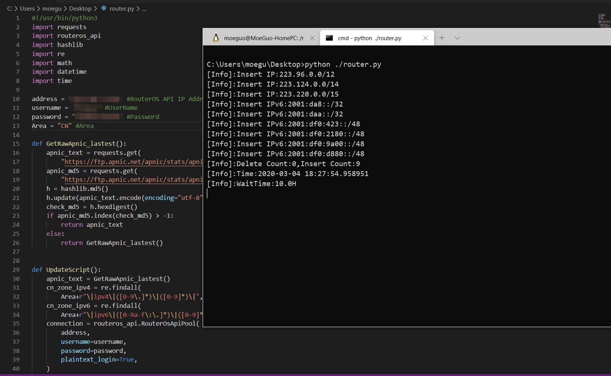

# RouterOS-AutoProxy
Get Target Area IPAddress To RouterOS Address-list

# How To Use
* Install API Pack For Python3 `pip3 install routeros_api`
* Edit `autoproxy.py` Fill Your Address、Username、Password
* Run `python3 ./autoproxy.py`

# Result
